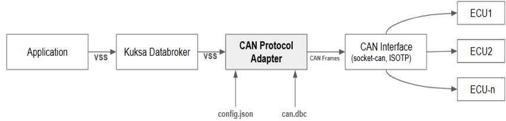

# CAN Protocol Adapter

The CAN Protocol Adapter is a **Rust-based solution** that offers communication between CAN devices and the Kuksa DataBroker using the Socket-CAN interface and ISO-TP (ISO Transport Protocol).

It can be used for various applications, including communication between CAN bus systems, supporting ISO-TP for segmented data transfer and reception of large payloads beyond the standard 8-byte limit and reading vehicle OBD-II PID data for diagnostics and monitoring.

## Key Features

- **User Configuration** : JSON-based user configuration for setting up CAN and Socket CAN interfaces, defining CAN request-response details, specifying protocol parameters, and mapping VSS and PID signal names.

- **Socket CAN Integration** : Compatible with Socket CAN interfaces for CAN bus communication in Linux-based environments.

- **Read CAN Frame and Decode**: Read CAN frames from the bus and decode them using DBC files, mapping the signals to their corresponding values.

- **Register and Feed Data Points to Data Broker**: Register VSS signal data points with Kuksa Data Broker and feed the decoded or interpreted values into the data broker.

## The basic functionality works as follows:

The application connects to the SocketCAN interface and sends all CAN requests, as specified in the PID table of the config file, based on a defined interval. The responses are read, and the raw CAN data is parsed according to the DBC file signals. The CAN signals are then translated into VSS data points based on the VSS and DBC signal mappings described in the config file. The respective VSS data points are then sent to the Kuksa Databroker.

## Initial Version (v0.1.0) Features

The details of the features, planned enhancements and known issues for the initial version (v0.1.0) can be found [here](doc/v0.1.0-initial-version.md).

## Getting started

- **Prerequisites**

    Install CAN utils, e.g. in Ubuntu machine 
    
        sudo apt update
        sudo apt install can-utils
    
    Linux Kernel Requirements
    
    The minimum required Linux kernel version is 5.10, and can-isotp has been part of the Linux mainline since version 5.10.

- **Configuration**

    The CAN Protocol Adapter offers different configuration options. For detailed instructions on how to use the CAN Adapter in various scenarios, please refer to [CAN Provider Configuration](doc/configuration.md)

- **Sample ISOTP DBC File**

    The DBC file [obd2_isotp_11bit.dbc](dbc/obd2_isotp_11bit.dbc) can be used for testing purposes. The repository contains a sample obd2_isotp DBC file with several signals as examples, which can be used to test OBD2 PIDs.

- **Kuksa APIs supported**

    CAN protocol adapter implements kuksa.val.v1.VAL  gRPC service interface currently.

## Building the application
**Using cargo to Build:**  

To compile the project in release mode using cargo

    cargo build --release

**Using the build.sh Script:**

Alternatively, you can use the provided build.sh script to build the project. The script performs additional security checks using tools like Clippy, Audit, and Deny before building the project.

    ./build.sh  x86_64-unknown-linux-gnu --release

The compiled binary is built as target/x86_64-unknown-linux-gnu/release/can-protocol-adapter.

## Running the application

In order to run the application you need to pass the config.json file as an argument like this:

    ./target/x86_64-unknown-linux-gnu/release/can-protocol-adapter –-config config.json

To enable logging use

    RUST_LOG=debug  ./target/x86_64-unknown-linux-gnu/release/can-protocol-adapter –-config  config.json

## Build Docker Image

Build the can-protocol-adapter as a Docker container:

    docker build -f Dockerfile --progress=plain -t can-protocol-adapter:latest .

## Build for a Different Architecture

To build for a different architecture, pass TARGETARCH as build argument currently Dockerfile supports amd64 and arm64 architectures:

    docker build -f Dockerfile --progress=plain -t can-protocol-adapter:latest --build-arg TARGETARCH=arm64 .

## Running the Docker Container

Run the container with the following command:

    docker run --network=host -v /<path_to_config>/config.json:/config/config.json -v /<path_to_dbc>/<dbc_file_name>.dbc:/data/<dbc_file_name>.dbc can-protocol-adapter:latest --config /config/config.json

    

  

