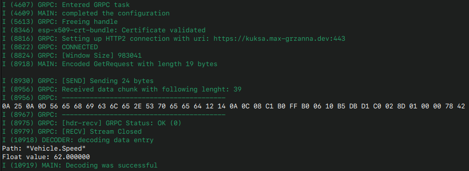

# gRPC on ESP32

This project offers a example on developing a gRPC client application designed to dispatch unary gRPC calls to a  gRPC server, utilizing HTTP/2 as the underlying protocol.

The project incorporates the following building blocks:

+ [ESP-IDF](https://github.com/espressif/esp-idf) - ESP-32 Development Framework

+ [nghttp2](https://nghttp2.org/) - integrated with [esp-idf extra components](https://components.espressif.com/components/espressif/nghttp)

+ [nanopb](https://github.com/nanopb/nanopb) - compilation of protobufs, encoding/decoding of messages and responses into binary wire format

+ [kuksa.val Databroker](https://github.com/eclipse/kuksa.val) - protobuf definitions for communicating via gRPC

Note that this is a simplistic illustration of interacting with the Kuksa Databroker. For more detailed message exchanges, consider starting with `encoder.c` or `decoder.c`. These files contain the protobuf-specific implementations necessary for the exchange. See `grpc.c` for the HTTP/2 gRPC implementation.

An application scenario would be conceivable in which the ESP32 represents a microcontroller that sends sensor values such as the current speed of the vehicle to the Kuksa Databroker via GRPC.

## Hardware Required

+ A development board with ESP32/ESP32-S2/ESP32-C3 SoC (e.g., ESP32-DevKitC, ESP-WROVER-KIT, etc.)
+ A USB cable for power supply and programming

## Configure the project

1. **Install the esp-idf toolchain** as shown in the esp-idf [docs](https://docs.espressif.com/projects/esp-idf/en/stable/esp32/get-started/index.html#installation).

```bash
idf.py menuconfig
```

2. **Incorporate nanopb specific header files**

```bash
chmod +x install_nanopb.sh
./install_nanopb.sh
```

3. **Compile Protobufs**

+ Activate the esp-idf development toolchain and environment with `. ./export.sh` inside your toolchain installation
directory (typically under `~/esp/...`)
+ execute shell script `compile_proto.sh`

> 📝 Sometimes nanopb will give you a warning, that some dependencies are not installed. Install them with `pip install protobuf grpcio-tools`

4. **Install expra components**
In the project root, execute the command below to add the nghttp2 lib to the project.

```bash
idf.py add-dependency "espressif/nghttp^1.58.0"
```

5. **Open the project configuration menu** (`idf.py menuconfig`) to configure Wi-Fi or Ethernet.

## Create Get/Set requests

Refer to the `main.c` file to modify the message type and set the target URL with a kuksa Databroker running. To send a request for retrieving information, such as the vehicle's current speed, utilize the get section of the code, which is already uncommented. If you wish to set a value in the broker, uncomment the set section and employ the defined constants for _set_.

## Build and Flash

Build the project and flash it to the board, then run monitor tool to view serial output:

```bash
idf.py flash monitor
```

(To exit the serial monitor, type ``Ctrl-]`` or ``Ctrl-TX`` on Mac.)

See the Getting Started Guide for full steps to configure and use ESP-IDF to build projects.

## Example Output


